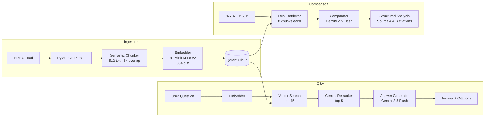
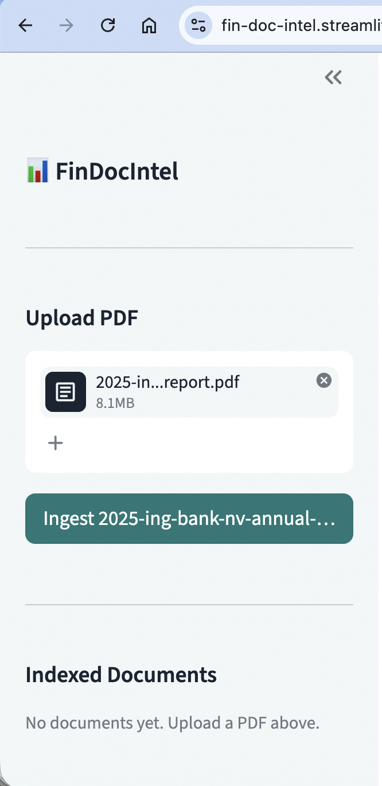
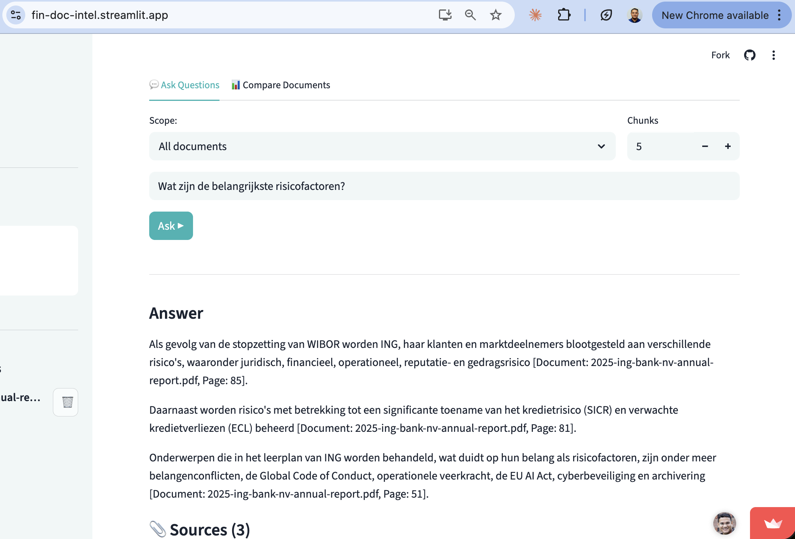
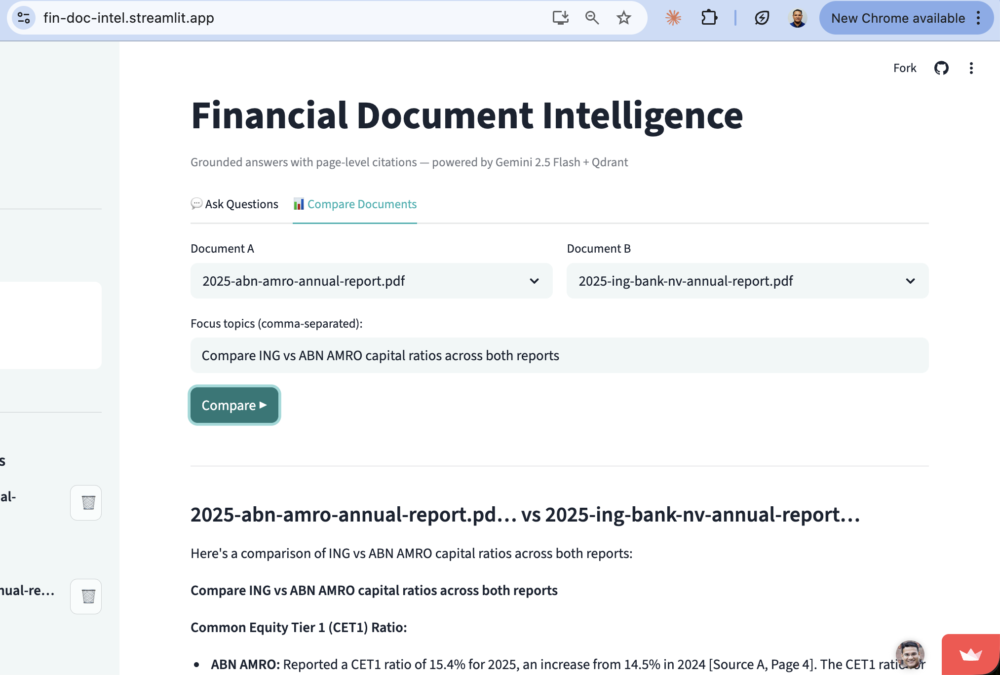

# 📊 FinDocIntel — Financial Document Intelligence Agent

[](https://www.python.org/)
[](https://streamlit.io/)
[](https://fastapi.tiangolo.com/)
[](https://ai.google.dev/)
[](https://qdrant.tech/)
[](LICENSE)

**Ask questions about financial PDFs and get grounded, page-cited answers — or compare two documents side by side.**

🚀 **[Live Demo → fin-doc-intel.streamlit.app](https://fin-doc-intel.streamlit.app)**

---

## Features

- **RAG Q&A** — Ask natural-language questions across one or multiple indexed documents; every claim is traced back to a specific page
- **Two-stage retrieval** — Qdrant cosine search (top 15 candidates) followed by Gemini re-ranking (top 5), for precision without sacrificing recall
- **Document comparison** — Select any two indexed documents and get a structured, topic-by-topic analysis with separate page citations per document
- **Page-level citations** — Answers reference exact page numbers; source text is shown in expandable citation boxes
- **Multi-document ingestion** — Upload PDFs via the sidebar; chunked, embedded, and indexed in seconds
- **Answer caching** — Repeated questions return instantly at zero API cost (1-hour TTL)
- **Graceful error handling** — Rate-limit (429) and overload (503) errors shown as friendly retry messages

---

## Architecture



---

## Tech Stack

| Layer | Technology |
|---|---|
| LLM | Google Gemini 2.5 Flash (`google-genai`) |
| Embeddings | `sentence-transformers` — `all-MiniLM-L6-v2` (local, 384-dim) |
| Vector DB | Qdrant Cloud |
| PDF parsing | PyMuPDF (`fitz`) |
| Backend | FastAPI + Uvicorn |
| Frontend | Streamlit (deployed on Streamlit Cloud) |
| Validation | Pydantic v2 |
| Config | `python-dotenv` + `.env` |

---

## Screenshots

| Upload & Index | Ask Questions | Compare Documents |
|---|---|---|
|  |  |  |

> **Note:** Drop screenshots into `docs/screenshots/` to populate this table.

---

## Quick Start

### Prerequisites

- Python 3.11+
- A [Google AI Studio](https://aistudio.google.com) API key (with billing enabled for production use)
- A [Qdrant Cloud](https://cloud.qdrant.io) cluster (free tier works)

### 1. Clone and install

```bash
git clone https://github.com/singhsudhir/fin-doc-intel.git
cd fin-doc-intel
python -m venv venv
source venv/bin/activate          # Windows: venv\Scripts\activate
pip install -r requirements.txt
```

### 2. Configure environment

```bash
cp .env.example .env
```

Edit `.env` with your credentials:

```env
GEMINI_API_KEY=your_gemini_api_key
QDRANT_URL=https://your-cluster.qdrant.io
QDRANT_API_KEY=your_qdrant_api_key
```

### 3. Run locally

**Option A — Standalone Streamlit (no backend needed):**

```bash
streamlit run streamlit_app.py
```

**Option B — FastAPI backend + Streamlit frontend:**

```bash
# Terminal 1
uvicorn src.api.main:app --reload --port 8000

# Terminal 2
streamlit run src/frontend/app.py
```

Open [http://localhost:8501](http://localhost:8501) in your browser.

### 4. Use the app

1. Upload a financial PDF using the sidebar (annual reports, credit memos, etc.)
2. Wait for ingestion to complete — the document appears in the **Indexed Documents** list
3. Type a question in the **Ask Questions** tab and click **Ask ▶**
4. Upload a second document and use the **Compare Documents** tab for side-by-side analysis

---

## Streamlit Cloud Deployment

1. Fork this repo and connect it to [Streamlit Cloud](https://share.streamlit.io)
2. Set **Main file path** to `streamlit_app.py`
3. Add secrets under **Settings → Secrets**:

```toml
GEMINI_API_KEY = "your_key"
QDRANT_URL     = "https://your-cluster.qdrant.io"
QDRANT_API_KEY = "your_key"
```

4. Deploy — no separate backend server required.

See `.streamlit/secrets.toml.example` for reference.

---

## API Endpoints

The FastAPI backend exposes the following REST API (available when running Option B):

| Method | Path | Description |
|---|---|---|
| `POST` | `/ingest` | Upload and index a PDF file |
| `POST` | `/query` | Ask a question, receive answer + citations |
| `POST` | `/query/compare` | Compare two indexed documents |
| `GET` | `/documents` | List all indexed documents |
| `DELETE` | `/documents/{name}` | Remove a document and its vectors |
| `GET` | `/health` | Liveness check |

---

## Project Structure

```
fin-doc-intel/
├── streamlit_app.py          # Standalone Streamlit Cloud entry point
├── src/
│   ├── api/                  # FastAPI app and route handlers
│   │   └── routes/           # ingest.py, query.py, documents.py, health.py
│   ├── ingestion/            # PDF parsing and ingestion pipeline
│   ├── chunking/             # Semantic chunking (sliding window, tiktoken)
│   ├── embedding/            # Sentence-transformers wrapper + Qdrant store
│   ├── retrieval/            # Two-stage retriever (vector search + re-ranking)
│   ├── generation/           # Gemini answer generator, comparator, utils
│   ├── models/               # Pydantic schemas and response models
│   └── frontend/             # Original Streamlit app (backend-coupled)
├── tests/                    # pytest test suite
├── .streamlit/
│   ├── config.toml           # Theme configuration
│   └── secrets.toml.example  # Secrets template
├── .env.example              # Environment variable template
├── requirements.txt          # Pinned dependencies
└── CLAUDE.md                 # Developer notes
```

---

## Running Tests

```bash
pytest tests/ -v
```

> Tests that touch Qdrant use a dedicated `test_` collection prefix and require valid environment variables.

---

## License

This project is licensed under the [MIT License](LICENSE).

---

## Author

**Sudhir Singh Kumar**
[LinkedIn](https://www.linkedin.com/in/sudhirsinghkumar/) · [GitHub](https://github.com/singhsudhir)
